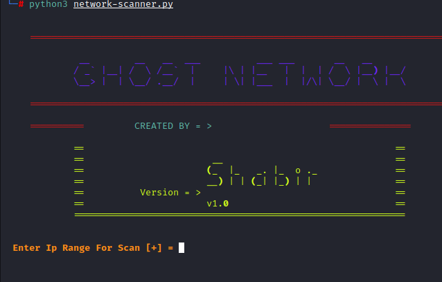

# network-scanner

<h5>Usage</h5>
<code>git clone https://github.com/ShabirKhan/network-scanner</code>

cd network-scanner</>

python3 network-scanner.py

<strong>NOTE: Provide your ip with Range Like(10.0.2.2/24) To search all subnets</strong>

<h6>Done</>
